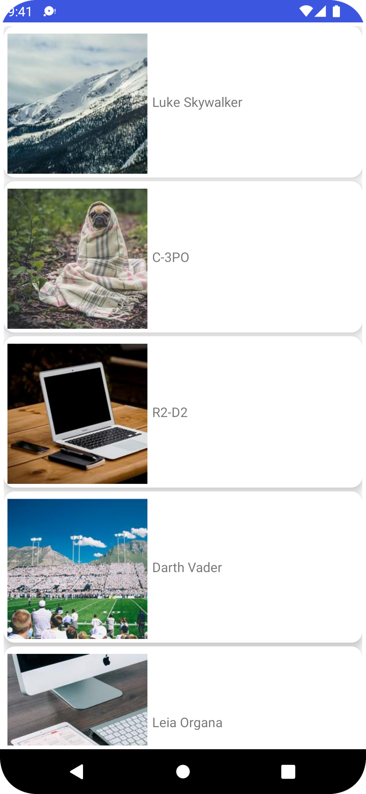
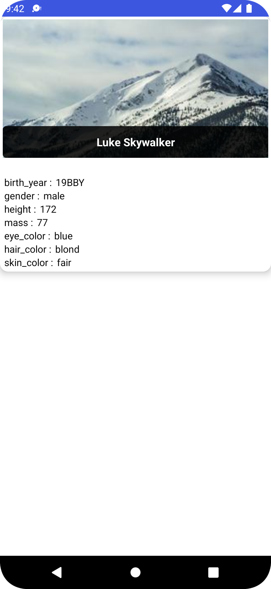

# RecyclerView-with-Databinding-Kotlin-Retrofit
### This project demonstrates a very important component that is RecyclerView and another important concept that is Data Binding together. While making this simple project we will follow the #MVVM (Model View ViewModel) and #Repository Architecture. And this project also uses Coroutine, Navigation Graph, LiveData, MutableLiveData and Many more.

## We are Fetching Data from API using Retrofit and Coroutines.
## Displaying the fetched data in RecyclerView 👉 Using Data Binding in RecyclerView Item 👉 Handling RecyclerView Item Click 👉 Using Navigation Architecture to Navigate when RecyclerView is Clicked.

# Deliverhealth
